<div align="center">
  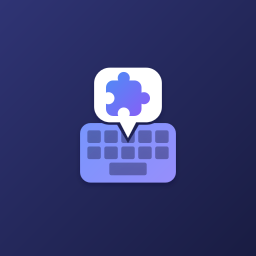
  <h1>WM Keyboard Official Addons</h1>
  <p>Official addon repository for WM Keyboard: themes, layouts, dictionaries, snippet packs, stickers, icon packs, fonts, emoji fonts, and key sounds.</p>
</div>

---

## Addons Catalog

To add this repository in **WM Keyboard**, open **Settings → Addons → Add repository** and paste the repository URL:
`https://github.com/wasi-master/wmkeyboard-addon-repository`

| Addon | Type | Description | Preview | Payload File |
|---|---|---|---|---|
| **Midnight** | `theme` | Deep navy dark theme with a soft blue gradient, squircle keys and a matching toolbar. | 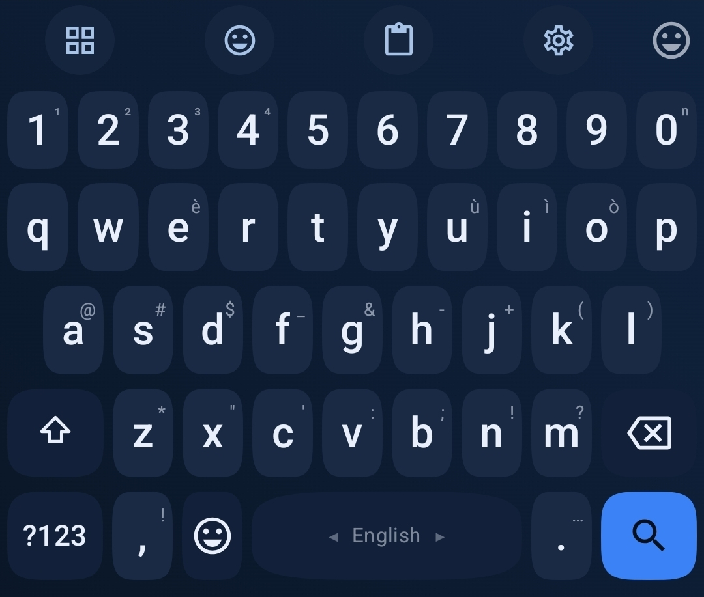 | [`themes/midnight.wmtheme.json`](themes/midnight.wmtheme.json) |
| **Braille (Unicode)** | `layout` | Types Unicode braille cells (⠁⠃⠉⠙) from QWERTY key positions, with the Latin letter on long-press and shown as the corner hint. Includes the capital and number signs. For writing braille as text — it is not a six-key chorded braille input. | 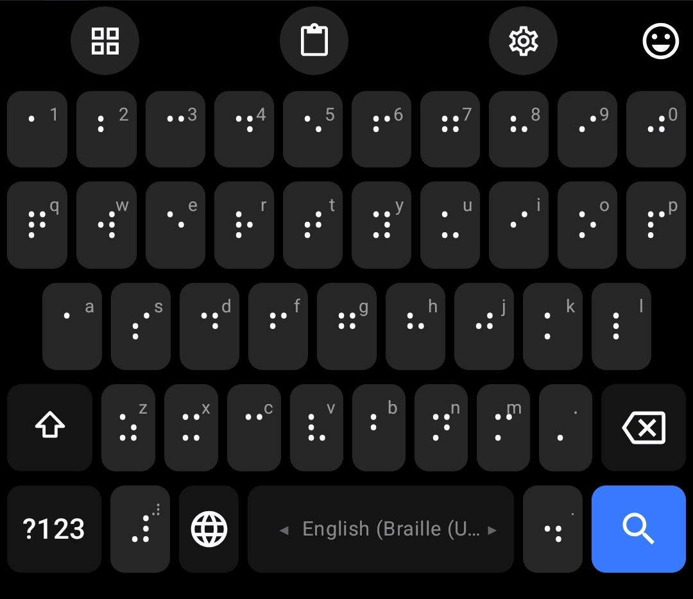 | [`layouts/braille.wmlayout.json`](layouts/braille.wmlayout.json) |
| **Developer Dictionary** | `dictionary` | An exhaustive developer dictionary containing top programming terms, syntax keywords, libraries, DevOps tools, databases, and methodologies. | 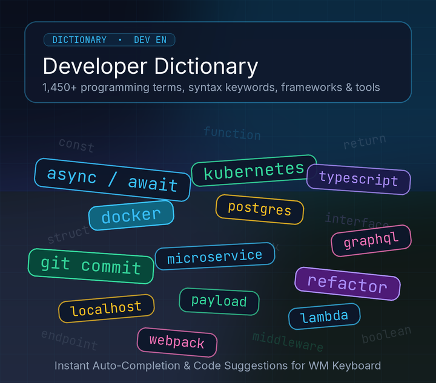 | [`dictionaries/en-developer.txt`](dictionaries/en-developer.txt) |
| **Internet Slang & Urban Dictionary** | `dictionary` | An exhaustive internet slang dictionary covering Gen Z, Gen Alpha, brainrot, Twitch emotes, TikTok trends, AI tech slang, anime/K-Pop culture, gaming terminology, and Urban Dictionary acronyms. | 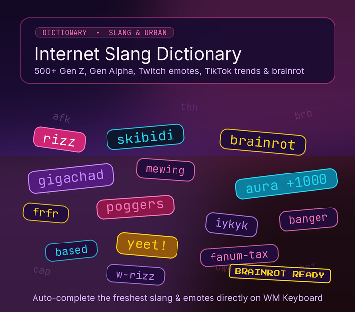 | [`dictionaries/en-slang.txt`](dictionaries/en-slang.txt) |
| **Texting Shortcuts** | `snippets` | A comprehensive collection of must-have texting shortcuts: quick conversational replies, common acronyms, and chat expansions. | 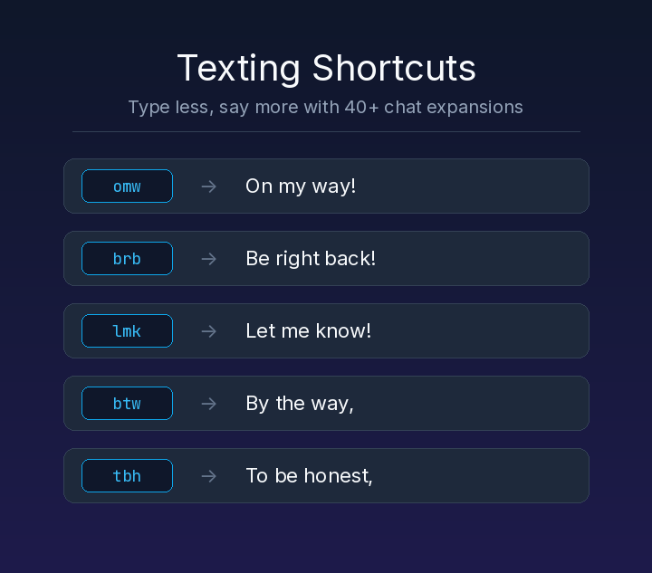 | [`snippets/texting-shortcuts.wmsnippets.json`](snippets/texting-shortcuts.wmsnippets.json) |
| **Lucide** | `icon_pack` | The complete keyboard icon set drawn in Lucide's 24px outline style: all 58 tools, every key glyph, the toolbar chrome and the emoji category tabs. Stroke-only and uncoloured, so it follows your theme and the per-tool accent colours. ISC licensed — see icons/LUCIDE-LICENSE.txt. | 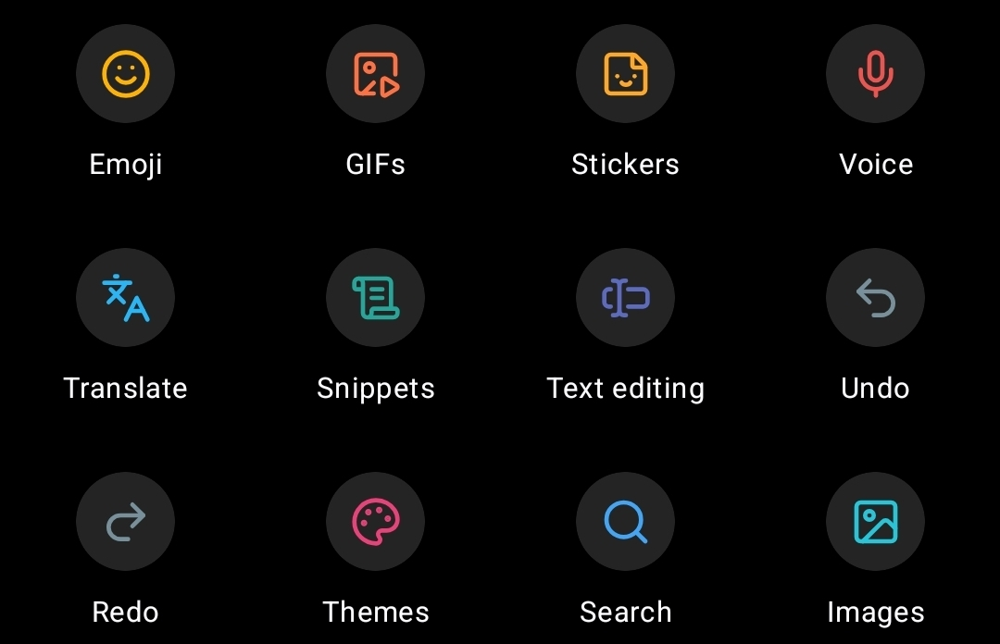 | [`icons/lucide.wmicons`](icons/lucide.wmicons) |
| **Bootstrap Icons** | `icon_pack` | The complete keyboard icon set drawn in Bootstrap Icons style: all 58 tools, every key glyph, the toolbar chrome and the emoji category tabs. Uncoloured fill/stroke SVG icons that follow your theme and per-tool accent colours. MIT licensed — see icons/BOOTSTRAP-LICENSE.txt. | 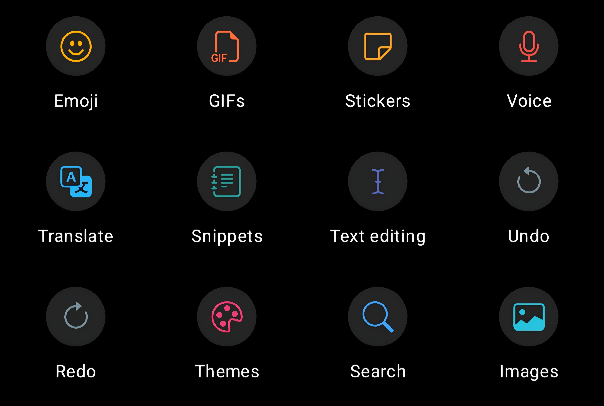 | [`icons/bootstrap-icons.wmicons`](icons/bootstrap-icons.wmicons) |
| **Boxicons** | `icon_pack` | The complete keyboard icon set drawn in Boxicons' 24px clean vector style: all 58 tools, every key glyph, the toolbar chrome and the emoji category tabs. Uncoloured and adaptive, so it follows your theme and per-tool accent colours. MIT licensed — see icons/BOXICONS-LICENSE.txt. | 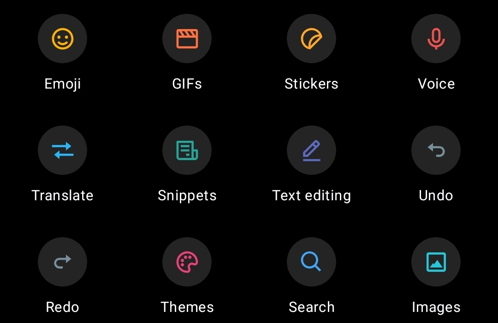 | [`icons/boxicons.wmicons`](icons/boxicons.wmicons) |
| **Font Awesome** | `icon_pack` | The complete keyboard icon set drawn in Font Awesome's iconic solid style: all 58 tools, every key glyph, toolbar chrome and emoji category tabs. Theme-following SVG icons. CC BY 4.0 licensed — see icons/FONTAWESOME-LICENSE.txt. | 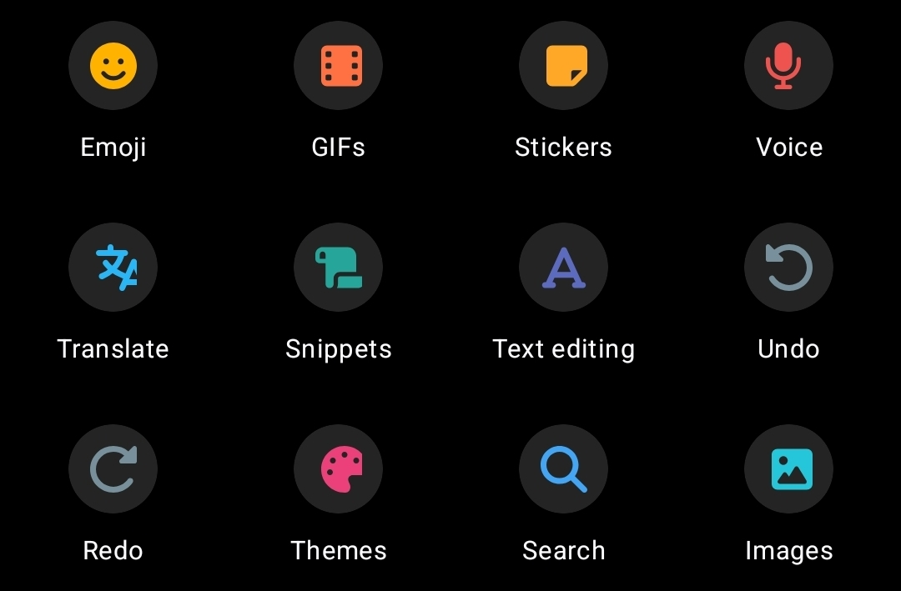 | [`icons/fontawesome.wmicons`](icons/fontawesome.wmicons) |
| **Inter** | `font` | A clean, highly legible variable sans-serif font family optimized for computer screens and mobile UI. | 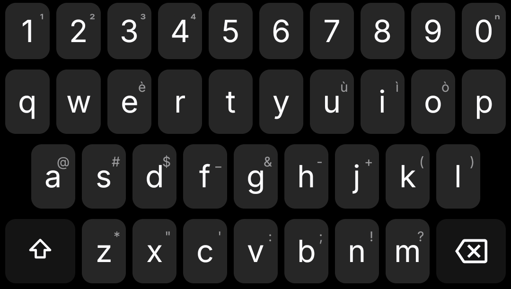 | [`fonts/inter.ttf`](fonts/inter.ttf) |
| **JetBrains Mono** | `font` | A monospaced font family created for developers and code editing. | 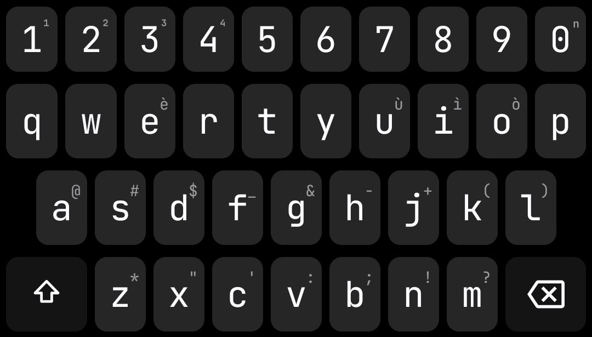 | [`fonts/jetbrains-mono.ttf`](fonts/jetbrains-mono.ttf) |
| **Caveat** | `font` | A casual and expressive handwriting script font with a natural aesthetic. | 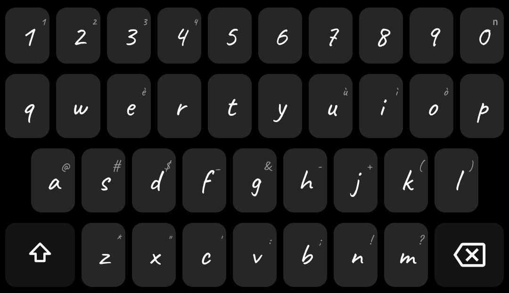 | [`fonts/caveat.ttf`](fonts/caveat.ttf) |
| **Press Start 2P** | `font` | A retro 8-bit arcade game bitmap font inspired by 1980s computer graphics. | 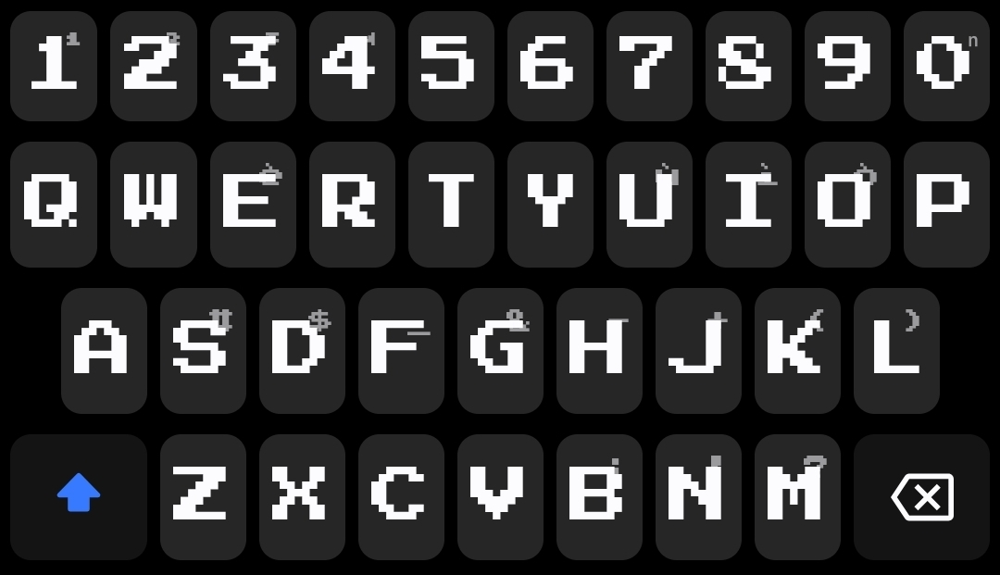 | [`fonts/press-start-2p.ttf`](fonts/press-start-2p.ttf) |
| **WM Font** | `font` | A casual and expressive handwriting script font with Latin, Greek letters, math symbols, fractions, and blackboard bold characters. | — | [`fonts/wm-font.ttf`](fonts/wm-font.ttf) |
| **Twemoji** | `emoji_font` | Twitter's emoji set as a colour font — the flat, friendly look used across the web. Mozilla's COLRv0 build, so it draws in colour on Android 8 and newer. | — | [`fonts/twemoji.ttf`](fonts/twemoji.ttf) |
| **OpenMoji Color** | `emoji_font` | The full-colour open-source OpenMoji set with hand-crafted illustrations, distinct outlines and vibrant palette. | — | [`fonts/openmoji-color.ttf`](fonts/openmoji-color.ttf) |
| **Emojitwo** | `emoji_font` | The open-source Emojitwo emoji set (fork of EmojiOne 2.2) as a COLRv0 colour font — flat, friendly vector emojis. | — | [`fonts/emojitwo.ttf`](fonts/emojitwo.ttf) |
| **unDraw Everyday Moments** | `stickers` | 40 expressive open-source vector illustrations from unDraw covering work, study, coding, space, sports, and everyday moods. | 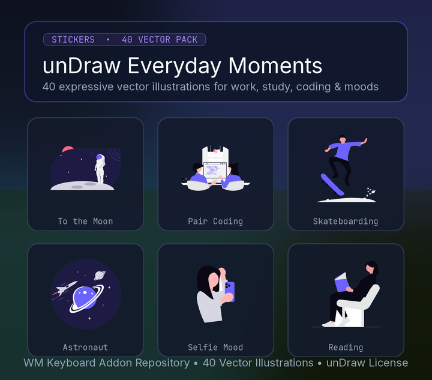 | [`stickers/undraw-illustrations.wmstickers`](stickers/undraw-illustrations.wmstickers) |
| **Typewriter** | `sound` | Mechanical typebar strike: a hard noise transient over a short woody thunk. CC0 — see sounds/SOUNDS-LICENSE.txt. | 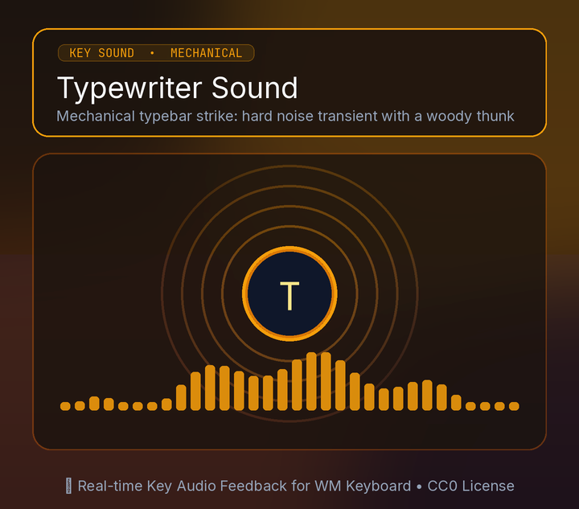 | [`sounds/typewriter.mp3`](sounds/typewriter.mp3) |
| **Marimba** | `sound` | Soft wooden mallet: a warm fundamental with its ringing fourth harmonic. CC0 — see sounds/SOUNDS-LICENSE.txt. | 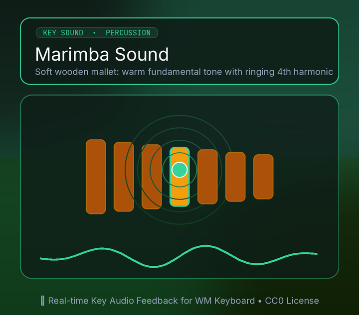 | [`sounds/marimba.mp3`](sounds/marimba.mp3) |
| **Droplet** | `sound` | Water drop: a fast upward pitch bend, no transient at all. CC0 — see sounds/SOUNDS-LICENSE.txt. | 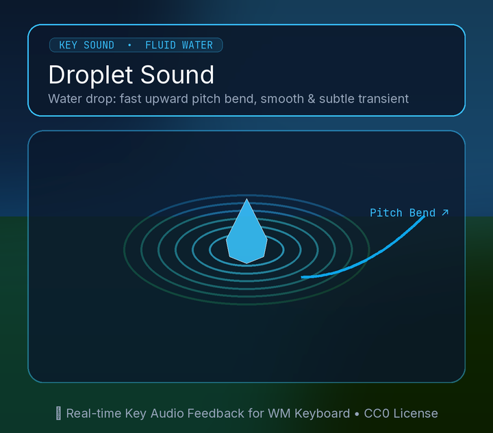 | [`sounds/droplet.mp3`](sounds/droplet.mp3) |
| **Blip** | `sound` | Retro square-wave blip with an 8-bit handheld flavour. CC0 — see sounds/SOUNDS-LICENSE.txt. | 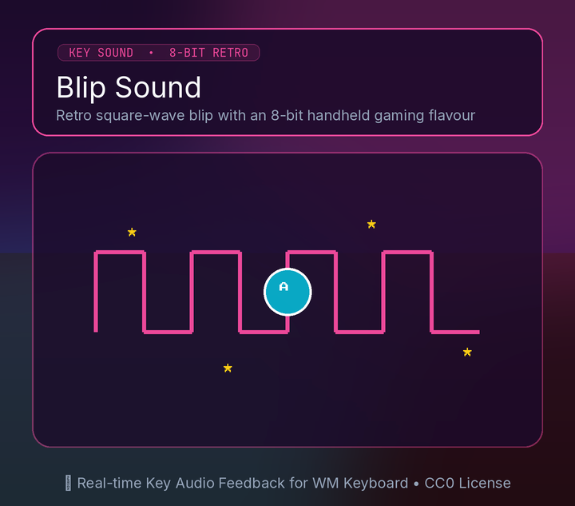 | [`sounds/blip.mp3`](sounds/blip.mp3) |
| **Cipher Tool** | `plugin` | Caesar and Vigenere ciphers, encode and decode. The plugin the getting-started guide builds. | — | [`plugins/cipher-tool.wmplugin`](plugins/cipher-tool.wmplugin) |
| **UI Kitchen Sink** | `plugin` | Every plugin widget and event in one place, to look at and copy from. | — | [`plugins/ui-kitchen-sink.wmplugin`](plugins/ui-kitchen-sink.wmplugin) |
| **Todo List** | `plugin` | A checklist that remembers itself. Shows how plugin storage works. | — | [`plugins/todo-list.wmplugin`](plugins/todo-list.wmplugin) |
| **Text Tools** | `plugin` | Change case, encode as base64/hex/URL, and count words. | — | [`plugins/text-tools.wmplugin`](plugins/text-tools.wmplugin) |

Everything is indexed by [`wmkeyboard-repo.json`](wmkeyboard-repo.json) at the repository root.

---

## Addon Details

**Icon packs.** Each of the four packs replaces all 90 icon slots (all 58 tools plus key glyphs, toolbar chrome and emoji category tabs) — drawn in [Lucide](https://lucide.dev)'s 24px outline set, [Boxicons](https://boxicons.com)' 24px vector set, [Bootstrap Icons](https://icons.getbootstrap.com)' vector set, and [Font Awesome Free](https://fontawesome.com)'s iconic solid set. The glyphs are uncoloured and adaptive, so they follow the keyboard theme and per-tool accent colours. Licences: Lucide ISC ([`icons/LUCIDE-LICENSE.txt`](icons/LUCIDE-LICENSE.txt)), Boxicons MIT ([`icons/BOXICONS-LICENSE.txt`](icons/BOXICONS-LICENSE.txt)), Bootstrap Icons MIT ([`icons/BOOTSTRAP-LICENSE.txt`](icons/BOOTSTRAP-LICENSE.txt)), Font Awesome CC BY 4.0 ([`icons/FONTAWESOME-LICENSE.txt`](icons/FONTAWESOME-LICENSE.txt)).

**Fonts.** **Inter** (clean UI sans-serif), **JetBrains Mono** (developer monospace), **Caveat** (handwriting script), **Press Start 2P** (retro 8-bit arcade), and **WM Font** (custom handwriting script with Latin, Greek, math symbols, fractions, and blackboard bold characters). All are licensed under the SIL Open Font License. Inter and JetBrains Mono declare `langIds: ["en", "ru", "el"]`; WM Font declares `["en", "el"]`; Caveat and Press Start 2P declare `["en"]`.

**Emoji fonts.** **Twemoji** (Twitter's colour set via Mozilla's COLRv0 build, CC BY 4.0 — [`fonts/TWEMOJI-LICENSE.txt`](fonts/TWEMOJI-LICENSE.txt)), **OpenMoji Color** (full-colour vector build with COLRv0 and SVG tables, CC BY-SA 4.0 — [`fonts/OPENMOJI-LICENSE.txt`](fonts/OPENMOJI-LICENSE.txt)), and **Emojitwo** (the open-source Emojitwo/EmojiOne 2.2 colour set via Emoji-COLRv0, CC BY 4.0 — [`fonts/EMOJITWO-LICENSE.txt`](fonts/EMOJITWO-LICENSE.txt)).

**Braille.** A layout that types Unicode braille cells (⠁⠃⠉⠙) from QWERTY key positions, with the Latin letter on long-press and shown as the corner hint.

**Sounds.** Four key-press sounds synthesised by [`tools/make_sounds.py`](tools/make_sounds.py) and released CC0 ([`sounds/SOUNDS-LICENSE.txt`](sounds/SOUNDS-LICENSE.txt)).

---

## Make Your Own Repository

1. Fork this repo (or copy the files).
2. Replace the payloads. The easiest way to get valid payloads: **export them from the WM Keyboard app** (a theme, a layout, a snippet pack, a sticker pack, an icon pack) and drop the exported files in.
3. Edit `wmkeyboard-repo.json` — one entry per addon. Include `"$schema"` pointing at the schema URL for IDE autocompletion and validation, and set each `path`.
4. Bump an addon's `version` (semver) whenever you update its file — that's how the app offers updates. Bump `repo.updatedAt` too.
5. Push to any public `https` host and share the URL.

### Checksums & Validation

`sha256` and `sizeBytes` are optional. Run tooling to keep them current and validate:

```bash
python3 tools/build_index.py
python3 tools/validate.py
```

Full spec, field tables and the JSON Schema live in [`docs/addons/`](docs/addons/):
[`REPO_FORMAT.md`](docs/addons/REPO_FORMAT.md), [`wmkeyboard-repo.schema.json`](docs/addons/wmkeyboard-repo.schema.json), [`CLIENT_DESIGN.md`](docs/addons/CLIENT_DESIGN.md).
