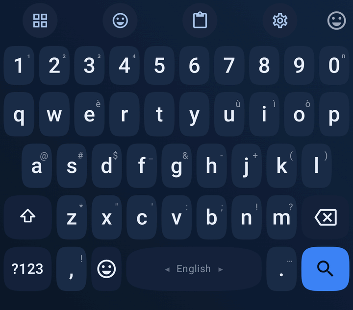
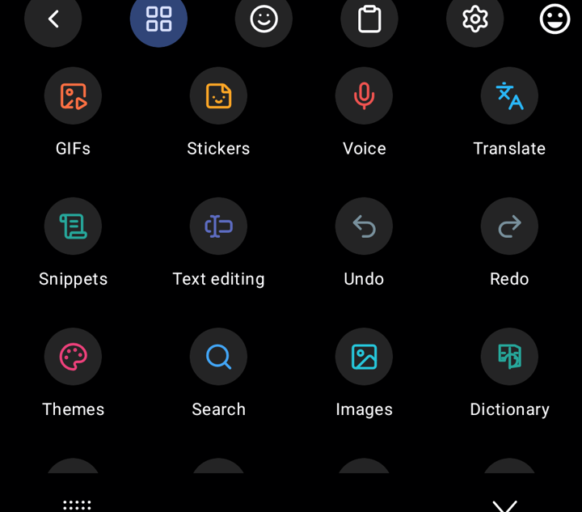

<div align="center">
  
  <h1>WM Keyboard Official Addons</h1>
  <p>Official addon repository for WM Keyboard: themes, layouts, dictionaries, snippet packs, stickers, icon packs, fonts, emoji fonts, and key sounds.</p>

  <p>
    <a href="wmkeyboard://repo?url=https%3A%2F%2Fgithub.com%2Fwasi-master%2Fwmkeyboard-addon-repository">
      
    </a>
    <a href="#addons">
      
    </a>
    <a href="wmkeyboard-repo.json">
      
    </a>
  </p>
</div>

---

## Addons

Below is the complete catalog of official addons available in this repository. Tap **Install** to install any addon directly into **WM Keyboard**.

| Addon | Type | Description | Preview | Install |
|---|---|---|---|---|
| **Midnight** | `theme` | Deep navy dark theme with a soft blue gradient, squircle keys and a matching toolbar. |  | [](wmkeyboard://addon?repo=https%3A%2F%2Fgithub.com%2Fwasi-master%2Fwmkeyboard-addon-repository&id=midnight) |
| **Braille (Unicode)** | `layout` | Types Unicode braille cells (⠁⠃⠉⠙) from QWERTY key positions, with the Latin letter on long-press and shown as the corner hint. Includes the capital and number signs. For writing braille as text — it is not a six-key chorded braille input. | — | [](wmkeyboard://addon?repo=https%3A%2F%2Fgithub.com%2Fwasi-master%2Fwmkeyboard-addon-repository&id=braille) |
| **Developer Dictionary** | `dictionary` | An exhaustive developer dictionary containing top programming terms, syntax keywords, libraries, DevOps tools, databases, and methodologies. | — | [](wmkeyboard://addon?repo=https%3A%2F%2Fgithub.com%2Fwasi-master%2Fwmkeyboard-addon-repository&id=en-developer) |
| **Internet Slang & Urban Dictionary** | `dictionary` | An exhaustive internet slang dictionary covering Gen Z, Gen Alpha, brainrot, Twitch emotes, TikTok trends, AI tech slang, anime/K-Pop culture, gaming terminology, and Urban Dictionary acronyms. | — | [](wmkeyboard://addon?repo=https%3A%2F%2Fgithub.com%2Fwasi-master%2Fwmkeyboard-addon-repository&id=en-slang) |
| **Handy snippets** | `snippets` | A few example text snippets with triggers. | — | [](wmkeyboard://addon?repo=https%3A%2F%2Fgithub.com%2Fwasi-master%2Fwmkeyboard-addon-repository&id=dev-shortcuts) |
| **Lucide** | `icon_pack` | The complete keyboard icon set drawn in Lucide's 24px outline style: all 58 tools, every key glyph, the toolbar chrome and the emoji category tabs. Stroke-only and uncoloured, so it follows your theme and the per-tool accent colours. ISC licensed — see icons/LUCIDE-LICENSE.txt. |  | [](wmkeyboard://addon?repo=https%3A%2F%2Fgithub.com%2Fwasi-master%2Fwmkeyboard-addon-repository&id=lucide) |
| **Bootstrap Icons** | `icon_pack` | The complete keyboard icon set drawn in Bootstrap Icons style: all 58 tools, every key glyph, the toolbar chrome and the emoji category tabs. Uncoloured fill/stroke SVG icons that follow your theme and per-tool accent colours. MIT licensed — see icons/BOOTSTRAP-LICENSE.txt. | — | [](wmkeyboard://addon?repo=https%3A%2F%2Fgithub.com%2Fwasi-master%2Fwmkeyboard-addon-repository&id=bootstrap-icons) |
| **Boxicons** | `icon_pack` | The complete keyboard icon set drawn in Boxicons' 24px clean vector style: all 58 tools, every key glyph, the toolbar chrome and the emoji category tabs. Uncoloured and adaptive, so it follows your theme and per-tool accent colours. MIT licensed — see icons/BOXICONS-LICENSE.txt. | — | [](wmkeyboard://addon?repo=https%3A%2F%2Fgithub.com%2Fwasi-master%2Fwmkeyboard-addon-repository&id=boxicons) |
| **Font Awesome** | `icon_pack` | The complete keyboard icon set drawn in Font Awesome's iconic solid style: all 58 tools, every key glyph, toolbar chrome and emoji category tabs. Theme-following SVG icons. CC BY 4.0 licensed — see icons/FONTAWESOME-LICENSE.txt. | — | [](wmkeyboard://addon?repo=https%3A%2F%2Fgithub.com%2Fwasi-master%2Fwmkeyboard-addon-repository&id=fontawesome) |
| **Inter** | `font` | A clean, highly legible variable sans-serif font family optimized for computer screens and mobile UI. | — | [](wmkeyboard://addon?repo=https%3A%2F%2Fgithub.com%2Fwasi-master%2Fwmkeyboard-addon-repository&id=inter) |
| **JetBrains Mono** | `font` | A monospaced font family created for developers and code editing. | — | [](wmkeyboard://addon?repo=https%3A%2F%2Fgithub.com%2Fwasi-master%2Fwmkeyboard-addon-repository&id=jetbrains-mono) |
| **Caveat** | `font` | A casual and expressive handwriting script font with a natural aesthetic. | — | [](wmkeyboard://addon?repo=https%3A%2F%2Fgithub.com%2Fwasi-master%2Fwmkeyboard-addon-repository&id=caveat) |
| **Press Start 2P** | `font` | A retro 8-bit arcade game bitmap font inspired by 1980s computer graphics. | — | [](wmkeyboard://addon?repo=https%3A%2F%2Fgithub.com%2Fwasi-master%2Fwmkeyboard-addon-repository&id=press-start-2p) |
| **Twemoji** | `emoji_font` | Twitter's emoji set as a colour font — the flat, friendly look used across the web. Mozilla's COLRv0 build, so it draws in colour on Android 8 and newer. | — | [](wmkeyboard://addon?repo=https%3A%2F%2Fgithub.com%2Fwasi-master%2Fwmkeyboard-addon-repository&id=twemoji) |
| **OpenMoji Color** | `emoji_font` | The full-colour open-source OpenMoji set with hand-crafted illustrations, distinct outlines and vibrant palette. | — | [](wmkeyboard://addon?repo=https%3A%2F%2Fgithub.com%2Fwasi-master%2Fwmkeyboard-addon-repository&id=openmoji-color) |
| **Emojitwo** | `emoji_font` | The open-source Emojitwo emoji set (fork of EmojiOne 2.2) as a COLRv0 colour font — flat, friendly vector emojis. | — | [](wmkeyboard://addon?repo=https%3A%2F%2Fgithub.com%2Fwasi-master%2Fwmkeyboard-addon-repository&id=emojitwo) |
| **unDraw Everyday Moments** | `stickers` | 40 expressive open-source vector illustrations from unDraw covering work, study, coding, space, sports, and everyday moods. | — | [](wmkeyboard://addon?repo=https%3A%2F%2Fgithub.com%2Fwasi-master%2Fwmkeyboard-addon-repository&id=undraw-illustrations) |
| **Typewriter** | `sound` | Mechanical typebar strike: a hard noise transient over a short woody thunk. CC0 — see sounds/SOUNDS-LICENSE.txt. | — | [](wmkeyboard://addon?repo=https%3A%2F%2Fgithub.com%2Fwasi-master%2Fwmkeyboard-addon-repository&id=typewriter) |
| **Marimba** | `sound` | Soft wooden mallet: a warm fundamental with its ringing fourth harmonic. CC0 — see sounds/SOUNDS-LICENSE.txt. | — | [](wmkeyboard://addon?repo=https%3A%2F%2Fgithub.com%2Fwasi-master%2Fwmkeyboard-addon-repository&id=marimba) |
| **Droplet** | `sound` | Water drop: a fast upward pitch bend, no transient at all. CC0 — see sounds/SOUNDS-LICENSE.txt. | — | [](wmkeyboard://addon?repo=https%3A%2F%2Fgithub.com%2Fwasi-master%2Fwmkeyboard-addon-repository&id=droplet) |
| **Blip** | `sound` | Retro square-wave blip with an 8-bit handheld flavour. CC0 — see sounds/SOUNDS-LICENSE.txt. | — | [](wmkeyboard://addon?repo=https%3A%2F%2Fgithub.com%2Fwasi-master%2Fwmkeyboard-addon-repository&id=blip) |

Everything is indexed by [`wmkeyboard-repo.json`](wmkeyboard-repo.json) at the repository root.

---

## Addon Details

**Icon packs.** Each of the four packs replaces all 90 icon slots (all 58 tools plus key glyphs, toolbar chrome and emoji category tabs) — drawn in [Lucide](https://lucide.dev)'s 24px outline set, [Boxicons](https://boxicons.com)' 24px vector set, [Bootstrap Icons](https://icons.getbootstrap.com)' vector set, and [Font Awesome Free](https://fontawesome.com)'s iconic solid set. The glyphs are uncoloured and adaptive, so they follow the keyboard theme and per-tool accent colours. Licences: Lucide ISC ([`icons/LUCIDE-LICENSE.txt`](icons/LUCIDE-LICENSE.txt)), Boxicons MIT ([`icons/BOXICONS-LICENSE.txt`](icons/BOXICONS-LICENSE.txt)), Bootstrap Icons MIT ([`icons/BOOTSTRAP-LICENSE.txt`](icons/BOOTSTRAP-LICENSE.txt)), Font Awesome CC BY 4.0 ([`icons/FONTAWESOME-LICENSE.txt`](icons/FONTAWESOME-LICENSE.txt)).

**Fonts.** **Inter** (clean UI sans-serif), **JetBrains Mono** (developer monospace), **Caveat** (handwriting script) and **Press Start 2P** (retro 8-bit arcade). All are licensed under the SIL Open Font License ([`fonts/OFL-LICENSE.txt`](fonts/OFL-LICENSE.txt)). Inter and JetBrains Mono declare `langIds: ["en", "ru", "el"]` — carrying Cyrillic and Greek as well as Latin; Caveat and Press Start 2P declare `["en"]`.

**Emoji fonts.** **Twemoji** (Twitter's colour set via Mozilla's COLRv0 build, CC BY 4.0 — [`fonts/TWEMOJI-LICENSE.txt`](fonts/TWEMOJI-LICENSE.txt)), **OpenMoji Color** (full-colour vector build with COLRv0 and SVG tables, CC BY-SA 4.0 — [`fonts/OPENMOJI-LICENSE.txt`](fonts/OPENMOJI-LICENSE.txt)), and **Emojitwo** (the open-source Emojitwo/EmojiOne 2.2 colour set via Emoji-COLRv0, CC BY 4.0 — [`fonts/EMOJITWO-LICENSE.txt`](fonts/EMOJITWO-LICENSE.txt)).

**Braille.** A layout that types Unicode braille cells (⠁⠃⠉⠙) from QWERTY key positions, with the Latin letter on long-press and shown as the corner hint.

**Sounds.** Four key-press sounds synthesised by [`tools/make_sounds.py`](tools/make_sounds.py) and released CC0 ([`sounds/SOUNDS-LICENSE.txt`](sounds/SOUNDS-LICENSE.txt)).

---

## Make Your Own Repository

1. Fork this repo (or copy the files).
2. Replace the payloads. The easiest way to get valid payloads: **export them from the WM Keyboard app** (a theme, a layout, a snippet pack, a sticker pack, an icon pack) and drop the exported files in.
3. Edit `wmkeyboard-repo.json` — one entry per addon. Include `"$schema"` pointing at the schema URL for IDE autocompletion and validation, and set each `path`.
4. Bump an addon's `version` (semver) whenever you update its file — that's how the app offers updates. Bump `repo.updatedAt` too.
5. Push to any public `https` host and share the URL.

Link straight to your repo, or to one addon inside it, with a `wmkeyboard://` URL:

```
wmkeyboard://repo?url=https://github.com/you/your-addons
wmkeyboard://addon?repo=https://github.com/you/your-addons&id=midnight
```

### Checksums & Validation

`sha256` and `sizeBytes` are optional. Run tooling to keep them current and validate:

```bash
python3 tools/build_index.py
python3 tools/validate.py
```

Full spec, field tables and the JSON Schema live in [`docs/addons/`](docs/addons/):
[`REPO_FORMAT.md`](docs/addons/REPO_FORMAT.md), [`wmkeyboard-repo.schema.json`](docs/addons/wmkeyboard-repo.schema.json), [`CLIENT_DESIGN.md`](docs/addons/CLIENT_DESIGN.md).
